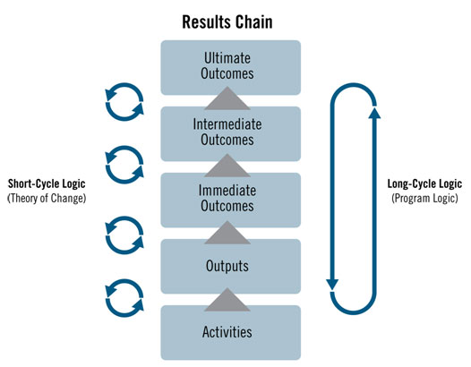

# Shining Light on Massachusetts: Solar Policy and Grant Access

Camden Droz, Ben Kim, Tane Koh, Toby Mallon, Audrey Renaud

------------------------------------------------------------------------

## ABSTRACT

## BACKGROUND

### *What is a solar panel?*

Solar Photovoltaic (PV) Panels convert sunlight into electrical energy using materials and devices called PV cells. These cells, made from semiconductor materials, are typically small, producing around 1 or 2 watts of power and are very thin. To form more substantial power-generating units, these cells are linked together into modules or panels, which can then be assembled into larger arrays to meet various power needs, whether small or large. A complete PV system includes not just the panels but also mounting structures to optimize sun exposure, and converters to change the direct current (DC) produced by the panels into alternating current (AC) used in homes. The largest PV installations, like the Solar Star PV power station in California, can produce significant amounts of electricity, such as 579 megawatts, demonstrating the scalability and utility of PV technology in contributing to energy needs.

### *Why go solar?*

**TL;DR: solar PV energy brings with it:**

-   **Cost savings**
-   **Major sustainability implications**
-   **Increased property value**
-   **Energy independence and security**
-   **Government Incentives**

Choosing solar photovoltaic energy offers several compelling benefits. Firstly, it leads to cost savings as solar panels can significantly reduce or even eliminate electricity bills, ensuring that the installation cost is recovered over the panels' lifespan of over 25 years. Additionally, solar energy contributes to sustainability by not producing greenhouse gases or air pollution, thereby reducing your carbon footprint and dependence on fossil fuels. Another advantage is increased energy independence and security; solar panels decrease reliance on large utility companies and their variable energy costs. Properties with solar installations also tend to increase in value and attract buyers faster, enhancing property desirability. Lastly, there are various government incentives available, such as tax credits, rebates, and grants, which make solar energy an economically attractive option.

### *Theory of Evalutation*

It is often difficult to analyze the impacts of any intervention (policy, financial incentive, program, etc.), especially at the state or federal level. There are potentially hundreds of chains of causality emanating from a single intervention that also have ties to hundreds if not thousands of other potential factors. As such, it would be ineffective to base the evaluation of government interventions on simple correlational factors, like trends in data being seen at the same time as the introduction of a certain intervention. To address this limitation, we can use a “theory-based” form of evaluation to provide a structure for evaluation that connects an intervention with the reasonably expected intended outcomes of said intervention. Figure 1[^1] describes this framework, displaying an initial intervention and an upward “ladder” of expected outcomes that incrementally lead to the “Ultimate” outcome the intervention looks to create.

[^1]: Treasury Board of Canada Secretariat. “Theory-Based Approaches to Evaluation: Concepts and Practices.” Canada.Ca, 22 Mar. 2021, www.canada.ca/en/treasury-board-secretariat/services/audit-evaluation/evaluation-government-canada/theory-based-approaches-evaluation-concepts-practices.html.

{fig-align="center"}

For the purposes of our research question, we may ask: “How can the effect of Massachusetts State-funded Grants and Loans be seen in the trends of Residential Solar Photovoltaic panel installations since 2000?”; this framework provides a guideline for evaluation of the effectiveness of the listed grants/loans in increasing the accessibility of Solar PV panels at the residential level.

> # ***How have grants made solar photovoltaic panels more accessible in Massachusetts at the residential level since 2000?***

## RESULTS

## CONCLUSIONS