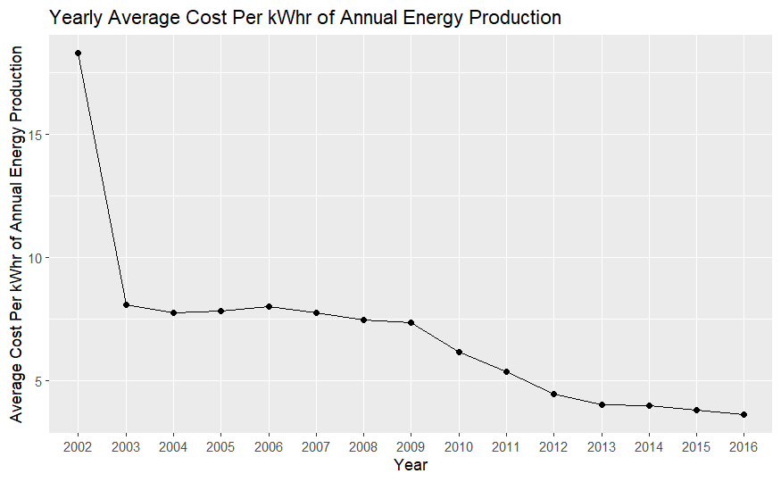
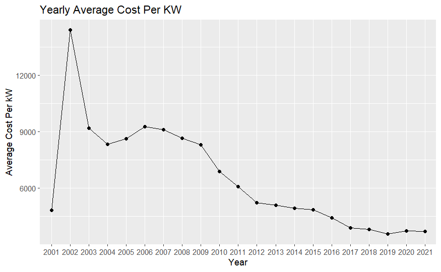
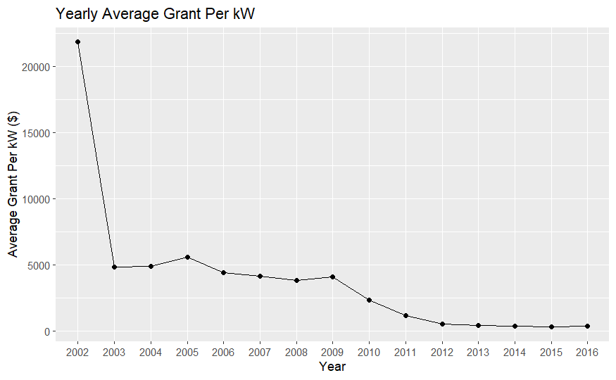
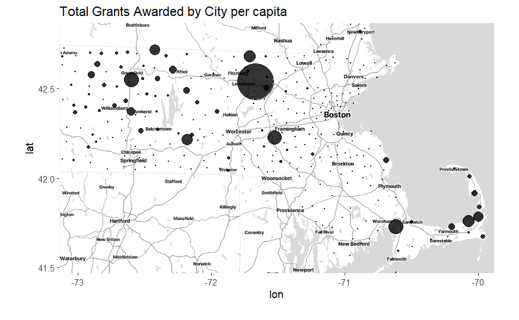
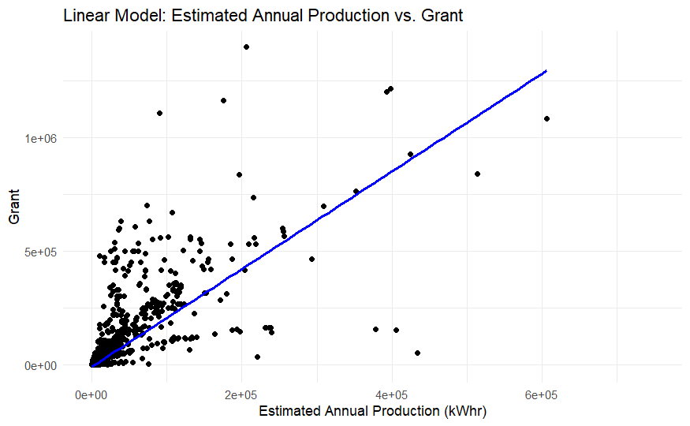
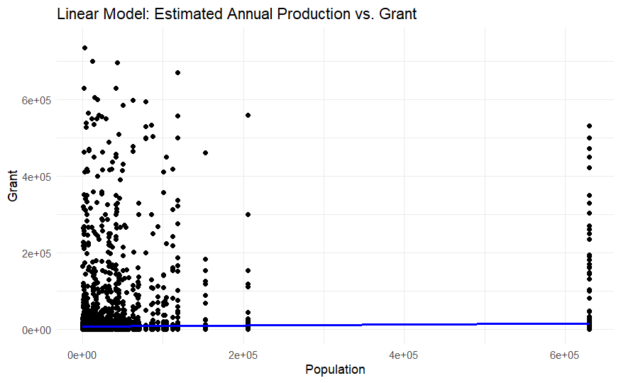
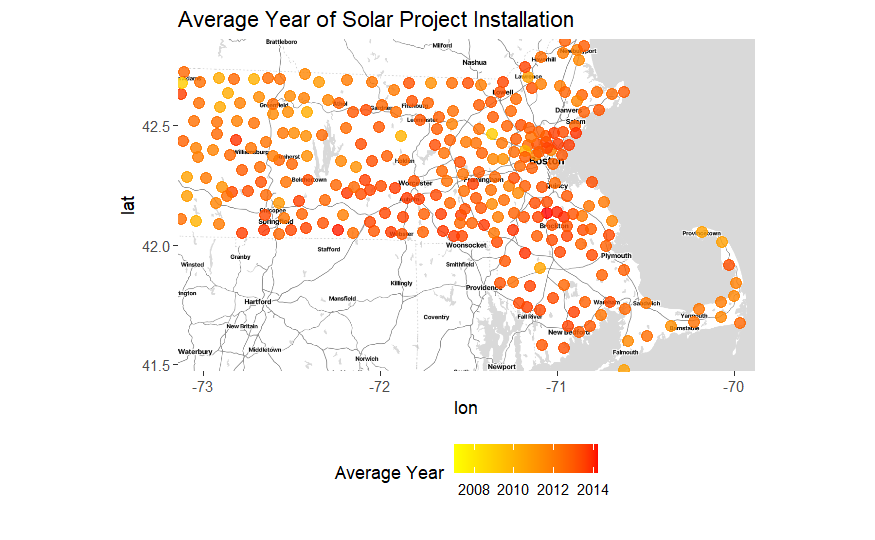
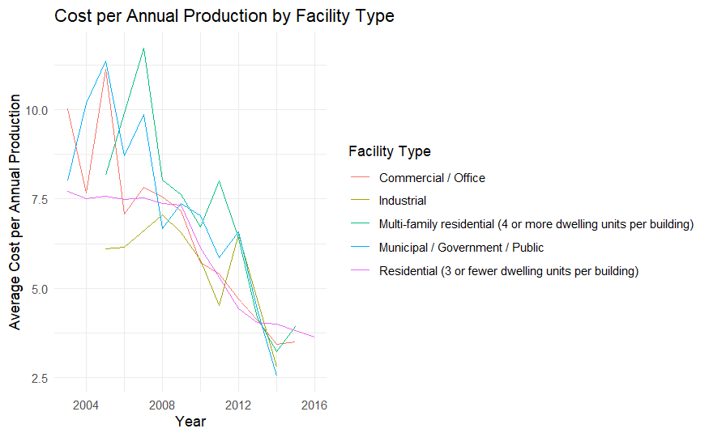
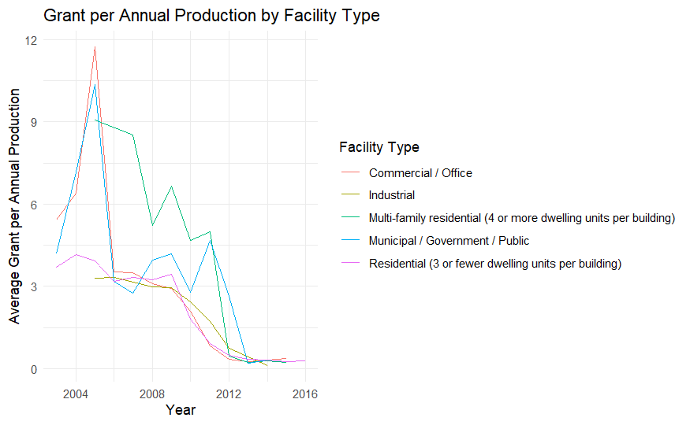
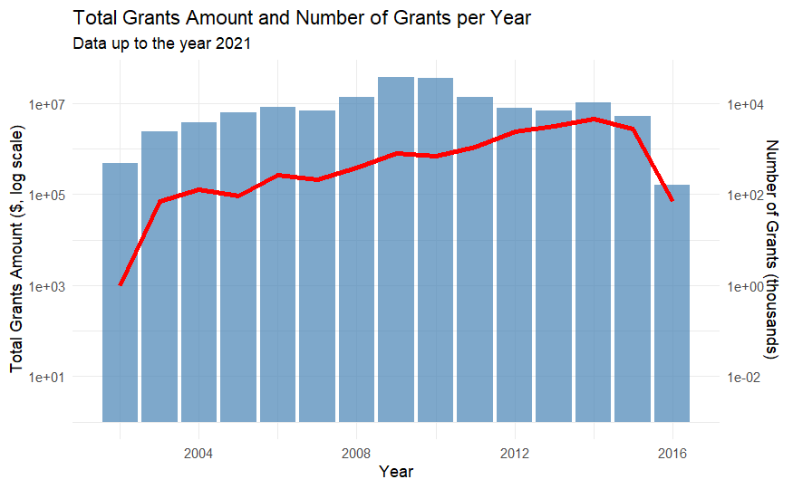

# Shining Light on Massachusetts: Solar Policy and Grant Access

Camden Droz, Ben Kim, Tane Koh, Toby Mallon, Audrey Renaud

------------------------------------------------------------------------

## Abstract

I know a lot of you are probably wondering how I'm feeling rn, and I appreciate all of yall's support during these troubling times. I think we all know that this country is going to shit, but I don't think any of us could have known it was going to get this horrible. I have been an FSU fan for all of two freaking weeks, and already I'm being served this bullshit by these national committee coolpeople, who handhold Alabama to the CFP every year because Nick Saban is giving them handies in the back office every bowl game. This tyranny cannot last any longer, and I henceforth will not be paying any income tax until this grave injustice is resolved. I leave you all with a quote from our divine creator, FSU Head Coach Mike Norvell: "I'm proud of the work we have put in and the players I have the privilege to coach. We have one more opportunity to define this 2023 team in the Orange Bowl, and I believe in how our team will respond. freak Alabama. freak the committee."

## Solar Photovoltaic Panels

## Theory of Evalutation

It is often difficult to analyze the impacts of any intervention (policy, financial incentive, program, etc.), especially at the state or federal level. There are potentially hundreds of chains of causality emanating from a single intervention that also have ties to hundreds if not thousands of other potential factors. As such, it would be ineffective to base the evaluation of government interventions on simple correlational factors, like trends in data being seen at the same time as the introduction of a certain intervention. To address this limitation, we can use a “theory-based” form of evaluation to provide a structure for evaluation that connects an intervention with the reasonably expected intended outcomes of said intervention. Figure 1 describes this framework, displaying an initial intervention and an upwards “ladder” of expected outcomes that incrementally lead to the “Ultimate” outcome the intervention looks to create.

# ***How have grants made solar photovoltaic panels more accessible in Massachusetts at the residential level since 2000?***

One change that may influence the rate at which solar energy is implemented is the price to change and install solar panels and the infrastructure. The cost being tracked here does not include government grants. From 2006 onwards, we see a steady decline in average cost per kW of capacity and a decline from 2002 in terms of average cost per production, suggesting that solar energy has become increasingly affordable. However, there does seem to be a plateau in cost efficiency in the last 4 years of data, suggesting that it may not be possible to further reduce costs.

Additionally, less money has been given out per kilowatt of production from the solar projects. This could be because the same money has been given out to increasingly more efficient projects, or because less money is being given out to projects in general.

#### Total Grant Funding

With this visualization, we can illustrate the total amount of money in grants given away per year with respect to the total amount of grants those are given out under. We can see a rise in both funding and number of grants until around 2010 where we see the total amount of money go down but the total amount of grants keep increasing. This trend seems to signify a continual increase in solar installations but a decreasing amount of money for said installations

           

## Limitations and Further Reflection

I know a lot of you are probably wondering how I'm feeling rn, and I appreciate all of yall's support during these troubling times. I think we all know that this country is going to shit, but I don't think any of us could have known it was going to get this horrible. I have been an FSU fan for all of two freaking weeks, and already I'm being served this bullshit by these national committee coolpeople, who handhold Alabama to the CFP every year because Nick Saban is giving them handies in the back office every bowl game. This tyranny cannot last any longer, and I henceforth will not be paying any income tax until this grave injustice is resolved. I leave you all with a quote from our divine creator, FSU Head Coach Mike Norvell: "I'm proud of the work we have put in and the players I have the privilege to coach. We have one more opportunity to define this 2023 team in the Orange Bowl, and I believe in how our team will respond. freak Alabama. freak the committee."