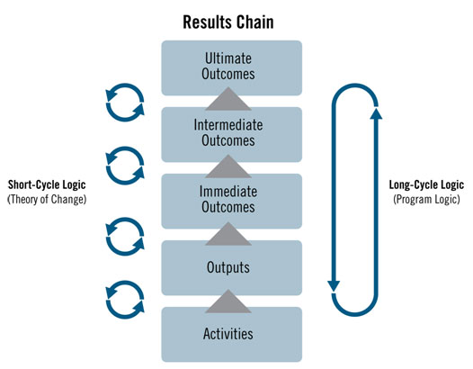

# Massachusetts Energy Policy: Solar Photovoltaic Grants

Camden Droz, Ben Kim, Tane Koh, Toby Mallon, Audrey Renaud

------------------------------------------------------------------------

## ABSTRACT

This report examines the role of state-funded grants and loans in the adoption of residential solar photovoltaic (PV) systems in Massachusetts since 2000. Using comprehensive data from sources like Energy Markets and Policy at Berkeley Lab and Massachusetts Clean Energy, we analyze trends in solar panel costs, grant allocations, and system capacities. Our findings highlight a significant reduction in the cost of solar installations, accompanied by a corresponding decrease in the average grant value over time. Despite these reductions, grants remain a critical factor in promoting solar energy adoption, particularly in areas with lower average income per capita. This study underscores the importance of targeted financial incentives in advancing sustainable energy solutions and provides a theory-based evaluation framework to assess the effectiveness of such policies. The analysis reveals that while grants have decreased in value, they continue to be instrumental in making solar energy accessible and sustainable, particularly in financially constrained communities.

## BACKGROUND

### *What is a solar panel?*

Solar Photovoltaic (PV) Panels transform sunlight into electrical energy using materials known as PV cells. These cells, crafted from semiconductor materials, are typically small, producing about 1 or 2 watts of power and are quite thin. To create more significant power-generating units, these cells are combined into modules or panels, which can then be grouped into larger arrays to satisfy various power needs, from small to large. A complete PV system includes not only the panels but also mounting structures to optimize sun exposure, and converters that transform the direct current (DC) produced by the panels into alternating current (AC) used in homes. The largest PV installations, such as the Solar Star PV power station in California, can generate substantial electricity amounts—up to 579 megawatts—demonstrating the scalability and utility of PV technology in addressing energy needs.

### *Why go solar?*

**TL;DR: solar PV energy brings with it:**

-   **Cost savings**
-   **Major sustainability implications**
-   **Increased property value**
-   **Energy independence and security**
-   **Government Incentives**

Opting for solar photovoltaic energy presents several appealing benefits. It leads to cost savings, as solar panels can significantly reduce or even eliminate electricity bills, ensuring the recovery of the installation cost over the panels' lifespan, which often exceeds 25 years. Additionally, solar energy supports sustainability by not producing greenhouse gases or air pollution, thus reducing your carbon footprint and dependence on fossil fuels. Another advantage is the increased energy independence and security; solar panels decrease reliance on large utility companies and their fluctuating energy costs. Properties with solar installations also tend to rise in value and attract buyers more quickly, enhancing property desirability. Furthermore, various government incentives, such as tax credits, rebates, and grants, make solar energy an economically attractive option.

### *Theory of Evalutation*

Analyzing the impacts of any intervention—whether policy, financial incentive, or program—especially at the state or federal level, is challenging. There are potentially hundreds of causality chains stemming from a single intervention, which also intersect with countless other factors. Therefore, it is ineffective to base the evaluation of government interventions solely on simple correlational factors, such as observing trends that coincide with the introduction of a specific intervention. To overcome this limitation, a “theory-based” form of evaluation can be employed to provide a structured approach that links an intervention to its reasonably expected intended outcomes. The below image outlines this framework, illustrating an initial intervention and an upward “ladder” of expected outcomes that lead incrementally to the “Ultimate” outcome that the intervention aims to achieve.

For the purposes of our research question, we may ask: **“How can the effect of Massachusetts State-funded Grants and Loans be seen in the trends of Residential Solar Photovoltaic panel installations since 2000?”**; this framework provides a guideline for evaluation of the effectiveness of the listed grants/loans in increasing the accessibility of Solar PV panels at the residential level.

> # **How can the effect of Massachusetts State-funded Grants and Loans be seen in the trends of Residential Solar Photovoltaic panel installations since 2000?**

### *Why Grants?*

The utilization of government grants as financial incentives for residential solar projects in Massachusetts is prevalent, accounting for approximately 70% of the projects according to our research. This makes grants the most widely used government financial incentive at the residential level within the state. The popularity of grants stems from their transparency; unlike other incentives such as loans or rebates, grants provide a flat sum which is easier to document and quantify. This straightforward nature of grants is beneficial as it facilitates the tracking and allocation of funds in datasets and analyses. Moreover, the emphasis on making solar panels accessible in residential areas raises questions about the affordability of sustainable practices.

## DATA SOURCING

1.  ***Tracking the Sun (2000-2022)***, a data source from Energy Markets and Policy at Berkley Lab*,* contains a very detailed range of information regarding residential and non-residential solar panel installations in the United States. It has the date of each installation, what state it took place, how much it cost, as well as the capacity and production of the installation (whether or not it was funded by a rebate or grant, etc). It even contained some really detailed information regarding the efficiency of the installation as well as what type of inverter it used and how well it worked.

2.  ***Solar Photovoltaic Installations in Massachusetts (2000-2021)*** is a similar data source from Massachusetts Clean Energy. It specifies each installation's funding source, grant value, grant program, and other residential details and funding details. The transparent cost data as well as the sourcing documentation was particularly helpful to us. Data from this set helped us to create visualizations that created comparisons of grant costs normalized for things like population and efficiency.

## ANALYSIS

### *Cost v. Time*

### *Average Grant Per kW v. Time*

One factor influencing the adoption rate of solar energy is the cost of acquiring and installing solar panels and their related infrastructure. The cost data presented here excludes government grants. From 2009 onwards, there has been a steady decrease in the average cost per kW of capacity, indicating that solar energy has become more affordable. However, there appears to be a plateau in cost reduction over the last four years, suggesting limitations in further cost reduction. Additionally, the amount of money awarded per kilowatt from solar projects has decreased. This could be due to either the same amount of money being distributed to more efficient projects or a general reduction in funds allocated to projects.

### *Estimated Capacity & Production by Year*

The data shows that while capacity and production have closely tracked each other over the last 20 years, they have been gradually increasing and diverging, with production consistently surpassing the capacity of our infrastructure.

### *Total Grants by City*

Geographical location significantly influences where grants are allocated. Cape Cod receives a substantial amount of residential grants per capita compared to the suburbs of Boston, which have similar space and funding. Additionally, more grants are observed in Western Massachusetts, possibly due to the availability of space. Both Cape Cod and Western Massachusetts were early adopters of solar technology.

### *Number of Grants per Funding Type by Year*

Multiple grant types are available in Massachusetts, with numerous subcategories for specialized purposes. The Commonwealth Solar grant program is the most prominent, targeted at homeowners for residential solar panel installations.

### *Average Grant Value v. Cost of Installation*

This visualization shows the declining trend in the cost of solar panel installations since 2009, alongside a faster decrease in the average grant amount.

### *Average Grant Amount v. Grants by Year*

This graph illustrates the average grant amount disbursed per year in relation to the total number of grants issued. There is a noticeable decrease in funding alongside a slight increase in the number of grants, indicating more installations but reduced funding per installation.

### *Grants Awarded v. Average Income Per Capita*

 

These visualizations compare the number of grants awarded between 2003-2012 and 2013-2021, with the average income per capita in each city during these periods. From 2013-2021, there was a 40% increase in the number of cities with grant recipients whose average income per capita was below the Massachusetts average.

## CONCLUSIONS

1.  Grants had a lot of value in earlier years (2000-2003) due to high installation costs. High grant value allowed solar PV panels to be much more accessible during this period.

2.  Grants continued to be distributed abundantly until 2011 and installations continued (2010-2012). We can reasonably deduce from this that grants were effective in increasing accessibility of solar PV.

3.  As installation costs have declined, grants have plummeted in average number and value.

4.  Other government incentives now have more value to sustain existing progress in the form of tax credits, rebates, feed-in tariffs, demand response incentives, and more.