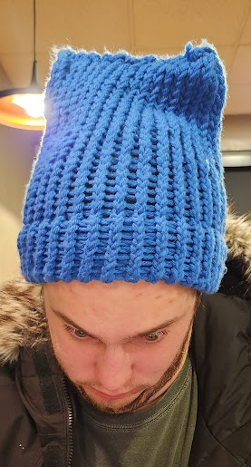

# Shining Light on Massachusetts: Solar Policy and Grant Access

Camden Droz, Ben Kim, Tane Koh, Toby Mallon, Audrey Renaud

------------------------------------------------------------------------

## Abstract

I know a lot of you are probably wondering how I'm feeling rn, and I appreciate all of yall's support during these troubling times. I think we all know that this country is going to shit, but I don't think any of us could have known it was going to get this horrible. I have been an FSU fan for all of two freaking weeks, and already I'm being served this bullshit by these national committee assholes, who handhold Alabama to the CFP every year because Nick Saban is giving them handies in the back office every bowl game. This tyranny cannot last any longer, and I henceforth will not be paying any income tax until this grave injustice is resolved. I leave you all with a quote from our divine creator, FSU Head Coach Mike Norvell: "I'm proud of the work we have put in and the players I have the privilege to coach. We have one more opportunity to define this 2023 team in the Orange Bowl, and I believe in how our team will respond. freak Alabama. freak the committee."

## Solar Photovoltaic Panels

I know a lot of you are probably wondering how I'm feeling rn, and I appreciate all of yall's support during these troubling times. I think we all know that this country is going to shit, but I don't think any of us could have known it was going to get this horrible. I have been an FSU fan for all of two freaking weeks, and already I'm being served this bullshit by these national committee assholes, who handhold Alabama to the CFP every year because Nick Saban is giving them handies in the back office every bowl game. This tyranny cannot last any longer, and I henceforth will not be paying any income tax until this grave injustice is resolved. I leave you all with a quote from our divine creator, FSU Head Coach Mike Norvell: "I'm proud of the work we have put in and the players I have the privilege to coach. We have one more opportunity to define this 2023 team in the Orange Bowl, and I believe in how our team will respond. freak Alabama. freak the committee."

## Theory of Evalutation

I know a lot of you are probably wondering how I'm feeling rn, and I appreciate all of yall's support during these troubling times. I think we all know that this country is going to shit, but I don't think any of us could have known it was going to get this horrible. I have been an FSU fan for all of two freaking weeks, and already I'm being served this bullshit by these national committee assholes, who handhold Alabama to the CFP every year because Nick Saban is giving them handies in the back office every bowl game. This tyranny cannot last any longer, and I henceforth will not be paying any income tax until this grave injustice is resolved. I leave you all with a quote from our divine creator, FSU Head Coach Mike Norvell: "I'm proud of the work we have put in and the players I have the privilege to coach. We have one more opportunity to define this 2023 team in the Orange Bowl, and I believe in how our team will respond. freak Alabama. freak the committee."

# ***How have grants made solar photovoltaic panels more accessible in Massachusetts at the residential level since 2000?***

# Conclusions

I know a lot of you are probably wondering how I'm feeling rn, and I appreciate all of yall's support during these troubling times. I think we all know that this country is going to shit, but I don't think any of us could have known it was going to get this horrible. I have been an FSU fan for all of two freaking weeks, and already I'm being served this bullshit by these national committee assholes, who handhold Alabama to the CFP every year because Nick Saban is giving them handies in the back office every bowl game. This tyranny cannot last any longer, and I henceforth will not be paying any income tax until this grave injustice is resolved. I leave you all with a quote from our divine creator, FSU Head Coach Mike Norvell: "I'm proud of the work we have put in and the players I have the privilege to coach. We have one more opportunity to define this 2023 team in the Orange Bowl, and I believe in how our team will respond. freak Alabama. freak the committee."

## Limitations and Further Reflection

I know a lot of you are probably wondering how I'm feeling rn, and I appreciate all of yall's support during these troubling times. I think we all know that this country is going to shit, but I don't think any of us could have known it was going to get this horrible. I have been an FSU fan for all of two freaking weeks, and already I'm being served this bullshit by these national committee assholes, who handhold Alabama to the CFP every year because Nick Saban is giving them handies in the back office every bowl game. This tyranny cannot last any longer, and I henceforth will not be paying any income tax until this grave injustice is resolved. I leave you all with a quote from our divine creator, FSU Head Coach Mike Norvell: "I'm proud of the work we have put in and the players I have the privilege to coach. We have one more opportunity to define this 2023 team in the Orange Bowl, and I believe in how our team will respond. freak Alabama. freak the committee."